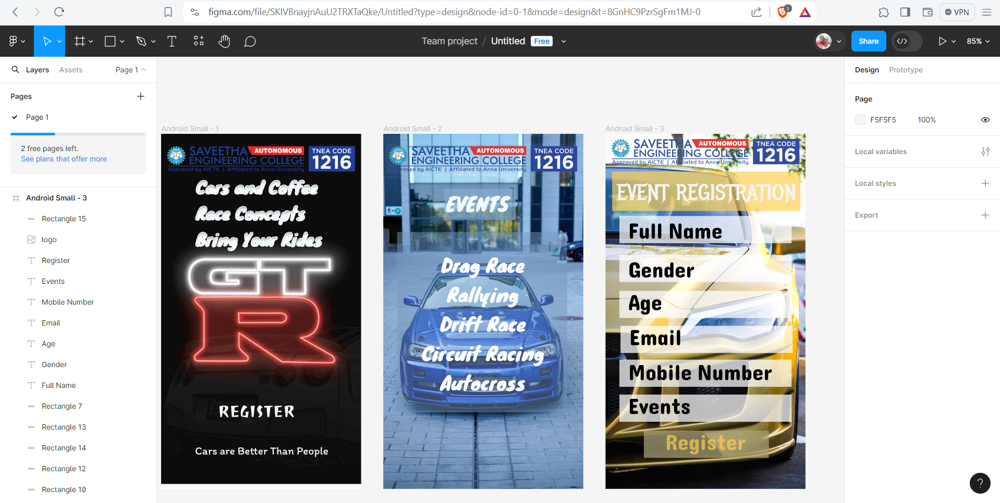

# Ex09 Event Registration Web Application
## Date:06/05/2024

## AIM:
To design, develop and deploy a web application for event registration.

## DESIGN STEPS:

### Step 1:
Create a new frame.

### Step 2:
Select any one preset size of your choice.

### Step 3:
Select the shapes you need.

### Step 4:
Import images as needed.

### Step 5:
Create pages based on your need and link them.

### Step 6:

Validate the HTML and CSS code.

### Step 6:

Publish the website in the given URL.

## DESIGN TOOL:
Figma

## CODE:
### Page 1:
```
<div style="width: 360px; height: 640px; position: relative; background: white">
  <div style="width: 161px; height: 46px; left: 99px; top: 480px; position: absolute; background: #0C0C0C"></div>
  
  
  <div style="width: 271px; height: 50px; left: 61px; top: 559px; position: absolute; color: white; font-size: 20px; font-family: Itim; font-weight: 400; word-wrap: break-word">Cars are Better Than People</div>
  <div style="width: 253px; height: 68px; left: 102px; top: 480px; position: absolute; color: white; font-size: 30px; font-family: Joti One; font-weight: 400; word-wrap: break-word">REGISTER</div>
  <div style="width: 310px; height: 94px; left: 63px; top: 72px; position: absolute; color: #F3FBFF; font-size: 30px; font-family: Knewave; font-weight: 400; word-wrap: break-word">Cars and Coffee<br/>Race Concepts<br/>Bring Your Rides</div>
</div>
```

### Page 2:
```
<div style="width: 360px; height: 640px; position: relative; background: white">
  <div style="width: 360px; height: 624px; left: -0px; top: 0px; position: absolute"></div>
  
  <div style="width: 128px; height: 56px; left: 110px; top: 99px; position: absolute; background: rgba(136, 174, 213, 0.62)"></div>
  <div style="width: 224px; height: 55px; left: 47px; top: 44px; position: absolute"><span style="color: black; font-size: 35px; font-family: Knewave; font-weight: 400; word-wrap: break-word"><br/>      </span><span style="color: #F3FBFF; font-size: 35px; font-family: Knewave; font-weight: 400; word-wrap: break-word">EVENTS</span></div>
  <div style="width: 306px; height: 325px; left: 25px; top: 177px; position: absolute; background: rgba(117, 151, 189, 0.49)"></div>
  <div style="width: 275px; height: 431px; left: 42px; top: 209px; position: absolute; text-align: center; color: white; font-size: 34px; font-family: Knewave; font-weight: 400; word-wrap: break-word">Drag Race<br/>Rallying<br/>Drift Race<br/>Circuit Racing<br/>Autocross</div>
  
  <div style="width: 350px; height: 55px; left: 5px; top: 17px; position: absolute; background: rgba(130, 167, 210, 0.09)"></div>
</div>
```

### Page 3:
```
<div style="width: 360px; height: 640px; position: relative; background: white">
  
  <div style="width: 339px; height: 71px; left: 12px; top: 68px; position: absolute; background: rgba(253, 208, 80, 0.68)"></div>
  <div style="width: 327px; height: 68px; left: 20px; top: 81px; position: absolute; color: #F5F5F5; font-size: 40px; font-family: Metal Mania; font-weight: 400; word-wrap: break-word">EVENT REGISTRATION</div>
  <div style="width: 310px; height: 49px; left: 25px; top: 148px; position: absolute; background: rgba(255, 255, 255, 0.73)"></div>
  <div style="width: 310px; height: 49px; left: 25px; top: 283px; position: absolute; background: rgba(255, 255, 255, 0.73)"></div>
  <div style="width: 310px; height: 49px; left: 27px; top: 346px; position: absolute; background: rgba(255, 255, 255, 0.73)"></div>
  <div style="width: 310px; height: 49px; left: 25px; top: 407px; position: absolute; background: rgba(255, 255, 255, 0.73)"></div>
  <div style="width: 225px; height: 49px; left: 69px; top: 535px; position: absolute; background: rgba(169, 160, 119, 0.73)"></div>
  <div style="width: 310px; height: 49px; left: 25px; top: 470px; position: absolute; background: rgba(255, 255, 255, 0.73)"></div>
  <div style="width: 310px; height: 49px; left: 25px; top: 218px; position: absolute; background: rgba(255, 255, 255, 0.73)"></div>
  <div style="width: 278px; height: 50px; left: 41px; top: 140px; position: absolute; color: black; font-size: 40px; font-family: Dangrek; font-weight: 400; word-wrap: break-word">Full Name</div>
  <div style="width: 278px; height: 50px; left: 41px; top: 210px; position: absolute; color: black; font-size: 40px; font-family: Dangrek; font-weight: 400; word-wrap: break-word">Gender</div>
  <div style="width: 278px; height: 50px; left: 41px; top: 269px; position: absolute; color: black; font-size: 40px; font-family: Dangrek; font-weight: 400; word-wrap: break-word">Age</div>
  <div style="width: 278px; height: 50px; left: 43px; top: 332px; position: absolute; color: black; font-size: 40px; font-family: Dangrek; font-weight: 400; word-wrap: break-word">Email</div>
  <div style="width: 278px; height: 50px; left: 41px; top: 395px; position: absolute; color: black; font-size: 40px; font-family: Dangrek; font-weight: 400; word-wrap: break-word">Mobile Number</div>
  <div style="width: 278px; height: 50px; left: 41px; top: 456px; position: absolute; color: black; font-size: 40px; font-family: Dangrek; font-weight: 400; word-wrap: break-word">Events<br/></div>
  <div style="width: 226px; height: 52px; left: 67px; top: 521px; position: absolute; text-align: center; color: rgba(253, 208, 80, 0.68); font-size: 40px; font-family: Dangrek; font-weight: 400; word-wrap: break-word">Register</div>
  
  <div style="width: 350px; height: 53px; left: 5px; top: 6px; position: absolute; background: rgba(255, 252, 223, 0.07)"></div>
</div>
```

## OUTPUT:


## RESULT:
The program to design, develop and deploy a web application for event registration is completed successfully.
